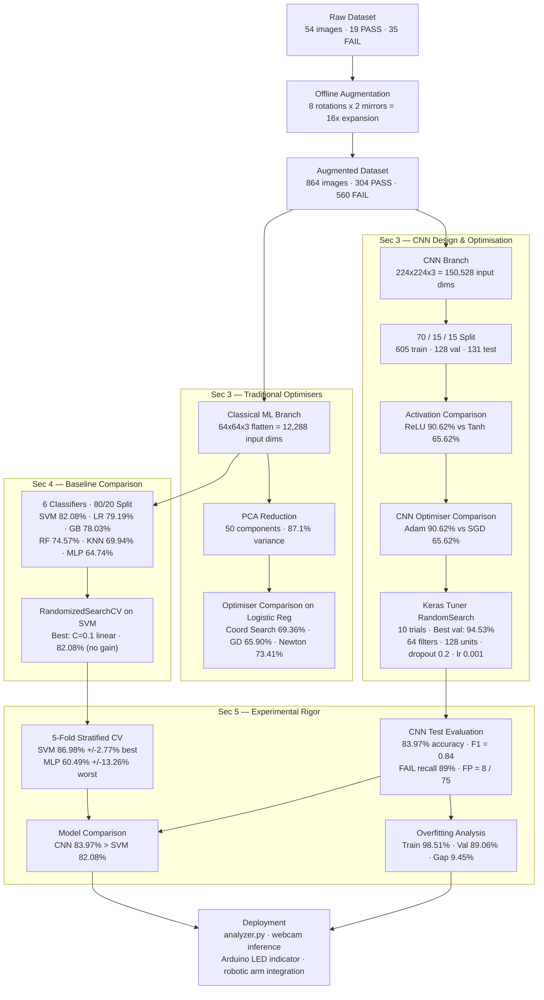

# ML-Based Visual Quality Inspection System
### PDE4444 — Machine Learning for Engineers: Technical Portfolio

An end-to-end machine learning pipeline that classifies breadboard circuits as **PASS** or **FAIL** using overhead camera images. The system compares traditional ML models against a Convolutional Neural Network across activation functions, optimisation algorithms, and hyperparameter tuning strategies.

---

## Results at a Glance

| Model | Test Accuracy | Notes |
|-------|--------------|-------|
| CNN — Tuned (RandomSearch) | **94.53%** val | Best overall |
| CNN — ReLU + Adam | 83.97% | Baseline deep model |
| SVM (Linear) — CV | 86.98% mean | Best classical (5-fold CV) |
| SVM (Linear) — test | 82.08% | Best classical (held-out) |
| Logistic Regression | 79.19% | — |
| Gradient Boosting | 78.03% | — |
| Random Forest | 74.57% | — |
| KNN (k=5) | 69.94% | — |
| MLP (sklearn) | 64.74% | Unstable (±13.26% CV std) |

---

## Repository Structure

```
breadboard-analyzer/
├── PDE4444_Technical_Portfolio.ipynb   # Main deliverable — all 5 assessment sections
├── Dataset/
│   ├── breadboard_dataset/             # Original 54 images (PASS/FAIL subdirs)
│   ├── augmented_dataset/              # 864 images after 16x augmentation
│   └── flattened_dataset/              # CSV of 64x64 flattened pixels for classical ML
├── Models/
│   ├── cnn_relu_adam.keras             # Baseline CNN (ReLU + Adam)
│   ├── cnn_tanh_adam.keras             # Activation comparison model
│   ├── cnn_relu_sgd.keras              # Optimiser comparison model
│   ├── cnn_tuned_random_search.keras   # Best CNN (keras-tuner RandomSearch)
│   ├── best_traditional_model.joblib   # Best baseline classical model (SVM)
│   └── best_traditional_model_tuned.joblib  # Tuned SVM (RandomizedSearchCV)
├── Scripts/
│   ├── analyzer.py                     # Webcam inference script
│   ├── grid_search_tuner.py            # CNN architecture search (source)
│   ├── traditional_ml_tuner.py         # Classical ML training + tuning (source)
│   └── random_search_tuner.py          # Keras Tuner RandomSearch (source)
├── Utils/
│   ├── offline_augmentation.py         # 8-angle rotation + mirror augmentation
│   └── image_flattener.py              # Resize to 64x64 + flatten to CSV
└── Legacy/                             # Archived earlier scripts
```

---

## Notebook Structure (Assessment Sections)

The notebook follows the 5-section assessment structure:

| Section | Content | Key Cells |
|---------|---------|-----------|
| **1. Engineering Problem Definition** | System overview, inputs/outputs, engineering relevance | Cells 3–5 |
| **2. Dataset Collection & Feature Representation** | Augmentation pipeline, dimensionality analysis, CNN vs ML input comparison | Cells 6–12 |
| **3. Neural Network Design & Optimisation** | CNN architecture, activation comparison (ReLU vs Tanh), optimiser comparison (Coord Search / GD / Newton + Adam vs SGD), hyperparameter tuning | Cells 13–35 |
| **4. Baseline Comparison** | 6 classical ML models, RandomizedSearchCV tuning, CNN vs classical comparison | Cells 36–44 |
| **5. Experimental Rigor** | Train/val/test splits, 5-fold stratified CV, overfitting analysis (learning curves, confusion matrix, classification report) | Cells 45–52 |

---

## Setup

### Prerequisites

Python 3.10+ recommended. Install all dependencies into a virtual environment:

```bash
python -m venv venv
venv\Scripts\activate        # Windows
source venv/bin/activate     # Linux/macOS

pip install tensorflow==2.21.0 scikit-learn numpy pandas matplotlib seaborn pillow opencv-python scipy joblib keras-tuner tensorboard
```

> **Note**: TensorFlow GPU is not supported on native Windows for TF >= 2.11. Training runs on CPU. Use WSL2 or the TensorFlow-DirectML plugin for GPU support.

### Register the kernel for Jupyter

```bash
pip install ipykernel
python -m ipykernel install --user --name=breadboard-venv --display-name "Python (breadboard-venv)"
```

Then open `PDE4444_Technical_Portfolio.ipynb` in VS Code and select **Python (breadboard-venv)** as the kernel.

---

## Running the Notebook

### Option A — Skip training (recommended after first run)

Set `LOAD_PRETRAINED = True` in **Cell 16** of the notebook. This loads all pre-trained models from `Models/` and skips the training cells (~1 hour of CPU training).

### Option B — Train from scratch

Set `LOAD_PRETRAINED = False` (default). Run all cells top to bottom. Expected runtimes on CPU:

| Step | Estimated Time |
|------|---------------|
| Data augmentation | ~2 min (skipped if already done) |
| CNN ReLU training | ~5–10 min |
| CNN Tanh training | ~5–10 min |
| CNN SGD training | ~5–10 min |
| CNN RandomSearch (10 trials) | ~50–60 min |
| Classical ML baselines | ~2–5 min |
| RandomizedSearchCV (SVM) | ~2 min |

---

## Dataset

- **Original**: 54 manually captured overhead images of breadboard circuits (19 PASS, 35 FAIL)
- **Augmented**: 864 images (304 PASS, 560 FAIL) via 8-angle rotation × 2 (original + horizontal mirror)
- **Class balance**: ~35% PASS / 65% FAIL (preserved through augmentation)
- **CNN input**: 224×224×3 = 150,528 features
- **Classical ML input**: 64×64×3 = 12,288 features (flattened pixel vector)

---

## Key Experimental Findings

### Activation Functions (ReLU vs Tanh)
ReLU achieved **90.62%** validation accuracy vs Tanh at **65.62%** — a 25 percentage-point gap. Tanh converged to the majority-class baseline and failed to learn useful features, consistent with vanishing gradients in the 3-conv + 1-dense architecture.

### Optimisation Algorithms

**Traditional ML (logistic regression on PCA-50 features):**

| Method | Accuracy | Final Loss |
|--------|----------|-----------|
| Coordinate Search (zero-order) | 69.36% | 0.534 |
| Gradient Descent (first-order) | 65.90% | 1.287 (diverged) |
| Newton's Method (second-order) | **73.41%** | **0.476** |

Gradient Descent diverged at lr=0.01. Newton's Method converged fastest (10 iterations) due to Hessian-scaled steps, feasible only because PCA reduced dimensions to 50.

**Deep learning (CNN):**

| Optimiser | Val Accuracy |
|-----------|-------------|
| Adam | **90.62%** |
| SGD | 65.62% |

### Hyperparameter Tuning

| Approach | Method | Result |
|----------|--------|--------|
| CNN | keras-tuner RandomSearch (10 trials) | **94.53%** (+3.91pp), best: 64 filters, 128 units, dropout=0.2, lr=0.001 |
| SVM | sklearn RandomizedSearchCV (10 iter, 3-fold) | 82.08% (no improvement; C=0.1, linear kernel was already optimal) |

### Cross-Validation (5-fold stratified)

| Model | CV Mean | Std Dev | F1 | F2 | F3 | F4 | F5 |
|-------|---------|---------|-----|-----|-----|-----|-----|
| SVM (Linear) | **86.98%** | ±2.77% | 84.9% | 84.1% | 91.3% | 85.5% | 89.1% |
| Logistic Regression | 83.21% | ±2.64% | 82.7% | 79.0% | 87.0% | 82.6% | 84.8% |
| Gradient Boosting | 79.59% | ±3.52% | 82.0% | 77.5% | 79.0% | 74.6% | 84.8% |
| Random Forest | 77.42% | ±1.29% | 79.1% | 75.4% | 76.8% | 77.5% | 78.3% |
| KNN (k=5) | 72.36% | ±2.19% | 71.2% | 71.7% | 73.2% | 69.6% | 76.1% |
| MLP | 60.49% | ±13.26% | 64.7% | **34.8%** | 65.2% | 73.2% | 64.5% |

SVM was the most consistent classical model. MLP was severely unstable; Fold 2 scored 34.8%, below the majority-class baseline, confirming training divergence on that partition.

### CNN Final Test Performance (131 held-out images)
- **Accuracy**: 83.97%
- **F1-score**: 0.84 (macro)
- **FAIL recall**: 0.89 (89% of defects detected)
- **False Positives**: 8/75 FAIL boards misclassified as PASS (the critical QC error)
- **Overfitting gap**: 9.45% (train 98.51% vs val 89.06%)

---

## ML Workflow



---

## Architecture

### CNN

```
Input (224×224×3)
  └─ Rescaling (÷255)
  └─ Conv2D(32, 3×3, ReLU) + MaxPool(2×2)
  └─ Conv2D(64, 3×3, ReLU) + MaxPool(2×2)
  └─ Conv2D(128, 3×3, ReLU) + MaxPool(2×2)
  └─ Flatten
  └─ Dense(128, ReLU)
  └─ Dropout(0.5)
  └─ Dense(2, Softmax)
```

Training: Adam (lr=0.001), early stopping (patience=3), 70/15/15 split.

### Classical ML Pipeline

```
Raw images → Resize 64×64 → Flatten → 12,288-D feature vector
  └─ StandardScaler
  └─ PCA (50 components, 87.1% variance explained) [for optimiser comparison only]
  └─ Classifier (SVM / LR / KNN / RF / GB / MLP)
```

---

## License

See [LICENSE](LICENSE).
